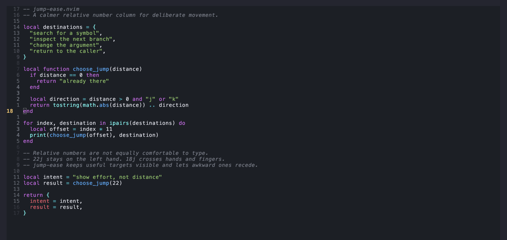

# jump-ease.nvim

**Relative line numbers ranked by how easy they are to type.**

If you are like me, touch typing a few numbers on the number row is a pain
(looking at you 7 and 8). However, some numbers are easy to type.

jump-ease highlights the relative counts that require less effort and dims the
ones that require more. It does not add mappings or change how motions work.



## Why

Relative line numbers show distance, but equal distances are not always equal
to type. `22j` keeps the count on the left hand while the right hand presses
`j`. `18j` requires more movement on the right hand.

jump-ease puts that information in the number column. Easier counts are more
visible, making them faster to find when choosing a vertical jump.

## How it works

Each count receives a score based on a QWERTY keyboard:

- Left-hand digits cost less.
- Repeated digits such as `22`, `33`, and `44` get a bonus.
- A final digit using the same finger as `j` or `k` gets a penalty.

The easiest counts use your colorscheme's `LineNr` highlight. Harder counts are
progressively blended into the background. Highlights are recalculated after a
colorscheme change.

## Requirements

- Neovim 0.9 or newer
- `number` and `relativenumber` enabled
- Foreground and background colors defined for `LineNr` and `Normal`

## Installation

jump-ease is currently a local experiment. Point your plugin loader at its
checkout.

### lazy.nvim

```lua
{
  dir = vim.fn.expand("~/path/to/jump-ease.nvim"),
  config = function()
    vim.opt.number = true
    vim.opt.relativenumber = true
    require("jump-ease").setup()
  end,
}
```

### Plain Neovim

```lua
vim.opt.runtimepath:prepend(vim.fn.expand("~/path/to/jump-ease.nvim"))
vim.opt.number = true
vim.opt.relativenumber = true
require("jump-ease").setup()
```

Call `setup()` after loading your colorscheme.

## Inspiration

jump-ease was inspired in part by
[comfy-line-numbers.nvim](https://github.com/mluders/comfy-line-numbers.nvim),
which keeps count entry on the left hand by replacing right-hand digits and
remapping `j` and `k` counts. jump-ease takes a less invasive approach: counts
stay unchanged and typing effort is shown through contrast.

## Notes

jump-ease sets the global `statuscolumn` option. It will conflict with another
plugin that also controls the status column.

Virtual lines are left blank to avoid displaying repeated line numbers. Fold
and sign column items remain available.
